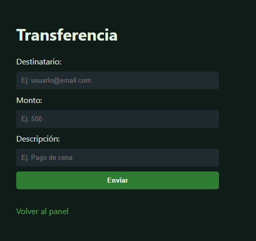
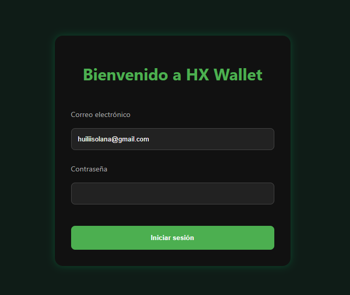

# 💸 HX Payments Web (Front)

**Frontend estático de HX Payments**, una billetera digital pensada para brindar una experiencia moderna y funcional a usuarixs que necesiten gestionar sus finanzas personales de forma sencilla, segura y ágil.

Este proyecto forma parte del desarrollo integral de **HX Payments**, e incluye su contraparte de backend construida con arquitectura de microservicios en Golang. Podés ver el backend [aquí](https://github.com/spookycoincidence/hx-payments-system).

Este proyecto fue concebido como un challenge técnico autoasistido, diseñado para simular un entorno profesional. 🙌🏻😎

---
## 🚀 Funcionalidades implementadas

- Registro e inicio de sesión de usuario
- Dashboard con balance y movimientos
- Envío de dinero entre usuarios
- Historial de transacciones
- Solicitud y recepción de transferencias
- Depósitos y extracciones
- Visualización y edición del perfil de usuario

## 🛠️ Tecnologías usadas

- HTML5 / Estructura de las vistas y componentes   
- CSS3 / Estilos generales, diseño responsivo y layout 
- JavaScript / Lógica de interacción y comportamiento básico

## 🧠 ¿Por qué este stack?

Elegi una solución estática basada en HTML, CSS y JavaScript puro para construir un prototipo rápido, claro y fácilmente adaptable. La idea fue priorizar:

- **Simplicidad**: sin necesidad de frameworks pesados para una etapa inicial de validación.
- **Flexibilidad**: se puede integrar rápidamente con distintos backends o migrar en el futuro.
- **Performance**: carga instantánea, ideal para testear UX/UI.
- **Portabilidad**: sin dependencias, puede correrse en cualquier navegador sin entorno adicional.

> En futuras versiones se prevé la integración de frameworks como React.


## 🔄 Integración con el backend

Este frontend fue desarrollado en conjunto con el backend del proyecto **HX Payments**, construido en Golang con arquitectura hexagonal.

Desde el front, se prevé la comunicación vía endpoints RESTful para:

- Autenticación de usuarios
- Envío y recepción de dinero
- Consulta de saldo y movimientos
- Modificación de datos personales

> Esta versión simula la experiencia visual.

---

## 💡 Diseño UI

Este proyecto fue diseñado previamente en Figma. A continuación, se muestran algunas vistas representativas de la interfaz:

### 📱 Versión Mobile




## 🧪 Cómo probar el proyecto localmente

1. Clonar el repositorio:

```bash
git clone https://github.com/spookycoincidence/hx-payments-web.git
```

2. Abrir index.html en tu navegador preferido.

No requiere servidor, ya que es 100% frontend.

---

## 📌 Estado del proyecto


✅ Módulo estático de frontend completado

🔧 Integración con backend y consumo de API REST

🧪 Futura fase: validaciones, testing y prototipado de nuevas vistas

## 👩🏻‍💻💻 Autora
Desarrollado por @HuilenVilches 🤓 (aka SpookyCoincidence 🕸️🕷️)
Golang Backend Developer 

Este proyecto forma parte de un challenge técnico autogestionado, simulado como si fuera parte de un entorno productivo real, pero completamente desarrollado sin ejecución ni dependencias externas.

## 📚 Licencia
MIT License © 2025 – Libre para aprender, compartir y adaptar 🚀
